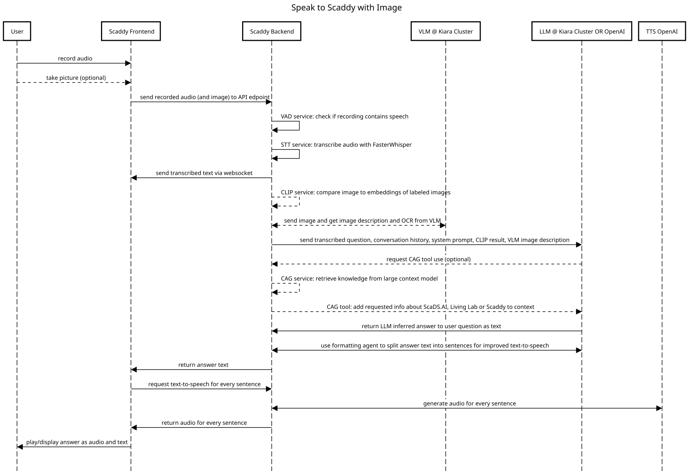
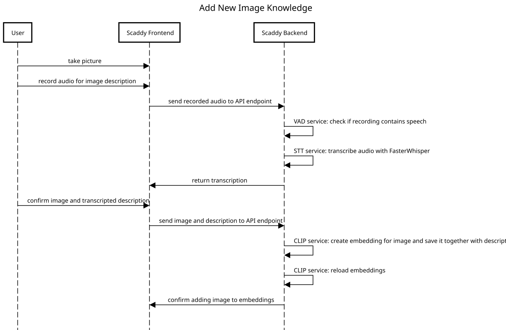

# Scaddy Backend Documentation

## 1. Overview

High-level explanation of what the backend does:

* Built with **FastAPI**
* Serves static SPA frontend
* Handles **speech**, **vision**, and **knowledge retrieval**
* Communicates via REST + WebSockets
* Runs either locally (dev) or in a remote Docker stack

## 2. Configuration

* `.env` variables (SCADS\_AI\_HPC\_API\_KEY, etc.)
* `/config/config.json` (local / stt\_local flags)
* SSL certificate setup (optional HTTPS)
* File paths for knowledge & embeddings

## 3. Module Overview

| Module                   | Path                                        | Purpose                                                 |
| ------------------------ | ------------------------------------------- | ------------------------------------------------------- |
| **VADService**           | `modules/audio/vad_service.py`              | Voice Activity Detection using Silero-VAD               |
| **STTService**           | `modules/audio/stt_service.py`              | Speech-to-Text (local faster-whisper or OpenAI Whisper) |
| **TTSService**           | `modules/audio/tts_service.py`              | Text-to-Speech (llm.scads.ai OmniVoice or Coqui)       |
| **OpenAIAgentsService**  | `modules/llm/agents_service.py`             | Conversation logic, LLM calls, CAG integration          |
| **CAGService**           | `modules/llm/cag_service.py`                | Cache-Augmented Generation via llm.scads.ai             |
| **CLIPService**          | `modules/vision/clip_service.py`            | Visual embeddings, similarity search (visRAG)           |
| **VLMService**           | `modules/vision/vlm_service.py`             | Vision-Language Model captioning & OCR                  |
| **ConversationProtocol** | `modules/protocol/conversation_protocol.py` | Stores conversation context for multi-turn dialogue     |

## 4. Main Interaction Flow

### 4.1 Audio Conversation with Optional Image

1. **Frontend** records audio (and optionally captures an image) → POST `/audio_enabled_conversation`
2. **Backend**:

   * Saves & converts audio to WAV
   * Runs VAD → abort if no voice detected
   * Runs STT to transcribe and _sends_ `stt_result` over WebSocket
   * If image provided:

     * CLIP similarity search vs. embeddings.json
     * VLM caption & OCR
     * Combine results into `image_description`
   * Passes transcription + image description + conversation history to LLM
   * Optionally provides domain knowledge via CAG service if requested by LLM
   * Writes result to protocol
   * Sends `scaddy_answer` over WebSocket
1. **Frontend** requests TTS sentence-by-sentence → `/tts_single_sentence`

**Sequence Diagram:**


### 4.2 Adding Visual Knowledge

1. **Frontend** sends base64 image + title + description → POST `/add_clip_embedding`
2. **Backend**:

   * Decodes & saves image
   * Generates CLIP embeddings
   * Appends to embeddings.json
   * Reloads embeddings in memory

**Sequence Diagram:**


## 5. Important Endpoints

| Endpoint                      | Method | Description                       |
| ----------------------------- | ------ | --------------------------------- |
| `/audio_enabled_conversation` | POST   | Main voice/image input handler    |
| `/tts_single_sentence`        | POST   | Get single-sentence TTS as base64 |
| `/stt_knowledge_annotation`   | POST   | STT for Add Knowledge mode        |
| `/add_clip_embedding`         | POST   | Add new visual knowledge entry    |
| `/reset`                      | POST   | Clear conversation protocol       |
| `/admin/config`               | GET    | Admin config page                 |
| `/admin/update_config`        | POST   | Change config.json                |
| `/admin/delete_embedding`     | POST   | Remove embedding entry            |
| `/admin/edit_cag`             | GET    | Edit scads.txt knowledge          |
| `/admin/save_cag`             | POST   | Save updated scads.txt            |

**Interactive API Documentation**
The backend exposes an auto-generated Swagger UI at:

```
https://localhost:8112/docs
```

(or `http://` if running without SSL)

From here you can:

* Explore all available endpoints.
* See request/response models.
* Test API calls directly from the browser.

FastAPI also provides the **ReDoc** view at:

```
https://localhost:8112/redoc
```

## 6. Decisions & Notes

* **VAD before STT** prevents empty audio from wasting API calls
* **CAG vs. RAG**: CAG is primary for institution-specific knowledge
* **visRAG**: CLIP embeddings allow image-based retrieval
* **OpenAI TTS sentence splitting** via `#pause#` tags for better playback timing
* **TTS voice** is configurable via `config/config.json["tts_voice"]` (and `/admin/config`); read per request so a change takes effect without restart. Default `"alloy"` — verify against `llm.scads.ai` (server expects a specific voice name for OmniVoice)
* **WebSocket** used for real-time STT results & answer streaming

## 7. Limitations

* `"local": true` uses the **llm.scads.ai** HPC endpoint, not pure offline mode
* STT local mode works, TTS local mode only via Coqui
* Self-signed SSL certificate may require browser acceptance
* CLIP similarity threshold tuning is heuristic

---
