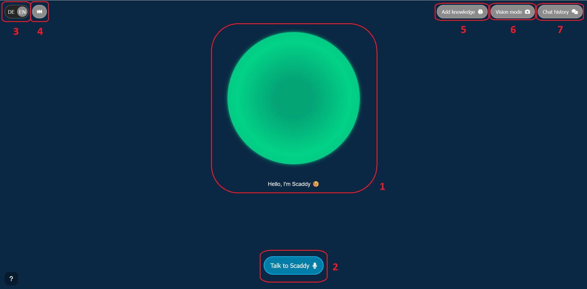
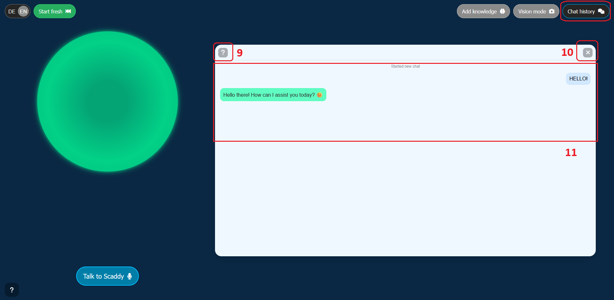
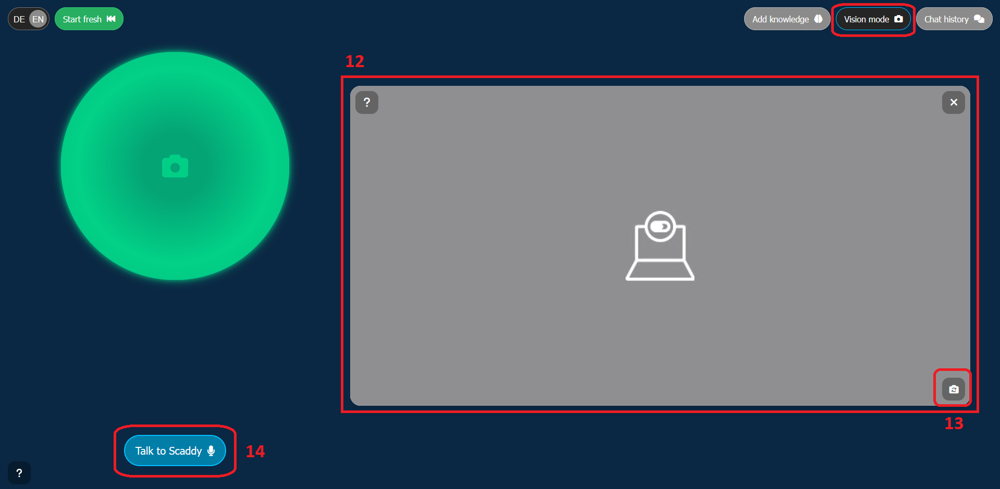
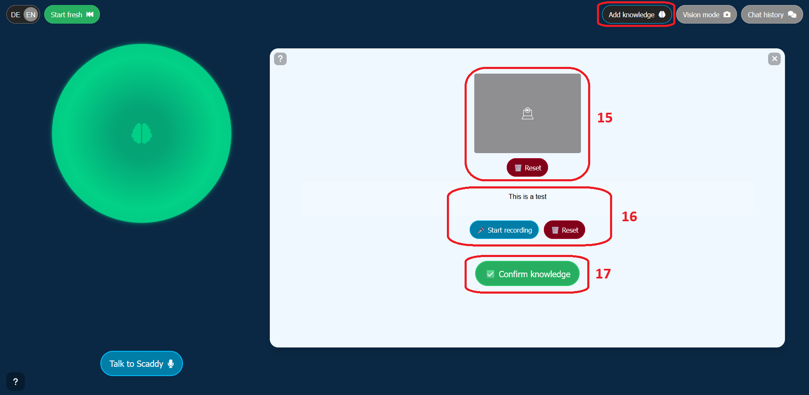

# General Usage

## **1. Introduction**

Scaddy is an **interactive, tablet-based conversational agent** designed for the ScaDS.AI Living Lab.
It combines **speech, vision, and knowledge retrieval** to provide visitors with engaging, context-aware interactions in both **English** and **German**.

Scaddy runs inside a **web-based UI** on a tablet device, backed by a **FastAPI server** running in a prepared **Docker Compose stack** on a remote GPU machine.
The tablet does **not** run the AI models locally — instead, it connects to the remote backend via a **pre-configured start script** that triggers the Docker stack through SSH and opens the UI in a browser.
For details on how the tablet starts Scaddy, see:
[Start via .bat (file is on desktop of Surface Tablet)](./start_via_bat_readme.md)

---

## **Core Capabilities**

Scaddy integrates multiple AI services:

* **Speech**

  * **VAD (Voice Activity Detection)** ensures only valid speech input is processed.
  * **STT (Speech-to-Text)** uses either a **local faster-whisper model** or the **OpenAI Whisper API** for transcription.
  * **TTS (Text-to-Speech)** uses the **Kokoro-82M model** via **llm.scads.ai** to speak Scaddy's replies sentence-by-sentence, synchronized with the UI.

* **Vision**

  * Captured images from the tablet’s front or rear camera are processed with a **CLIP model** for similarity search against the **visual knowledge base** (visRAG).
  * Images are also sent to a **Vision-Language Model (VLM)** for **captioning and OCR**, enabling Scaddy to describe new, previously unseen images.

* **Knowledge Retrieval**

  * **CAG (Cache-Augmented Generation)**: Scaddy can load large context documents (like `scads.txt`) directly into the LLM’s context for accurate retrieval without a database query.
  * **RAG (Retrieval-Augmented Generation)**: When needed, Scaddy retrieves structured information from a knowledge base to answer questions.
  * **visRAG**: A specialized visual RAG pipeline powered by CLIP to recall knowledge linked to images.

---

## **Main UI**

When Scaddy starts, the main interface is displayed:


The centerpiece is a **dynamic green sphere**, which visually represents Scaddy’s current state:

* **Idle** – softly pulsing
* **Listening** – microphone icon in center of sphere
* **Thinking** – brain icon in center of sphere
* **Speaking** - brighter color, rapid pulsing in sync with audio
* **Vision Mode** – camera icon in center of sphere
* **Add Knowledge Mode** – brain icon in center of sphere


Below the sphere is the **subtitle area**, showing either:

* What Scaddy is saying (live during TTS playback)
* Status messages (e.g. “Listening…”, “Thinking…”, etc.)
* A Greeting messages before first interaction

The **top bar** offers quick access to:

* Chat history
* Vision mode (camera)
* Add Knowledge mode
* Reset conversation button
* Language switch (DE / EN)

Interaction is designed to be **hands-on and visual** — a single tap can start a voice conversation, capture an image, or teach Scaddy something new.

---

## **2. Getting Started**

Scaddy can be launched in two main ways, depending on whether you are **starting it remotely from the tablet** or **running it locally for development**.

---

### **Option 1: Start via Tablet and `.bat` Script (Recommended for Visitors)**

On the deployed tablet, Scaddy is started through a **pre-configured Windows batch file** that:

1. Connects to the remote GPU server via **SSH**.
2. Starts the **Docker Compose stack** containing Scaddy’s backend.
3. Waits a short time for the backend to be ready.
4. Opens Scaddy’s UI in the browser.

This ensures the tablet user does not have to manage servers or commands manually.

For instructions & how it works, see:
[`start_via_bat_readme.md`](./start_via_bat_readme.md)

---

### **Option 2: Start Locally via Virtual Environment (For Development)**

If you want to run Scaddy locally for testing or development:

1. **Activate your Python virtual environment** (venv or uv):

   ```bash
   # If using uv (recommended)
   source .venv/bin/activate   # macOS/Linux
   .venv\Scripts\activate      # Windows

   # Or with a standard venv
   source .venv/bin/activate   # macOS/Linux
   .venv\Scripts\activate      # Windows
   ```

   **Be sure to follow te setup guide in [README.md](../README.md) beforehand.**

2. **Run the backend with Uvicorn**:

   ```bash
   uvicorn main:app --host 0.0.0.0 --port 8112 --ssl-keyfile=./ssl_certificate/key.pem --ssl-certfile=./ssl_certificate/cert.pem
   ```

   Adjust paths to SSL certificates or run without `--ssl-*` flags for HTTP.

3. **Access the UI** in your browser:

   ```
   https://localhost:8112 || https:[ip]:8112
   ```

   with using your machine’s (or the machine that is running the app) LAN IP for access from another device.

---


# **3. Quick Start**

Once Scaddy has been started (either via the **tablet’s `.bat` script** or by running the backend locally), you can immediately begin interacting through the web-based interface.

This section will guide you through the **first moments** after launch.

---



## **Step 1 — Verify Connection**

When Scaddy is ready, you should see the **main UI** in your browser (or fullscreen on the tablet). We recommend using Mozilla Firefox and we designed it mainly for this browser. Chrome(-ium) should work too. 
Maybe you have to firstly accept the "insecure" SSL-certificate when your browswer is warning you. This is due to the fact the certificate is ´self-signed´. 

* The **green sphere** will be in **idle mode** (soft pulse). [1]
* The **subtitle area** may display a greeting such as *“Hello, I’m Scaddy!”* or *“Hallo, ich bin Scaddy!”* depending on the active language. [1]
* The **top bar** will show the control buttons for **Chat View**, **Vision Mode**, **Add Knowledge**, **Reset**, and **Language Switch**. [5, 6, 7]

If you don’t see this, verify:

* The tablet/PC is on the correct network (same as the backend server). Use VPN if needed.
* The backend server’s Docker stack is running.
* For local development, that `uvicorn main:app ...` is still active.

---

## **Step 2 — Select Your Language**

Scaddy supports **English** and **German** interactions.

* Use the **language switch toggle** in the top right corner. [3]
* Switching language changes **both** speech recognition (**STT**) and speech output (**TTS**) as well as all UI labels.
* The backend receives the selected language setting via the `/set_language` route, ensuring that **LLM responses are always in the correct language**.

---

## **Step 3 — Start Talking to Scaddy**

1. **Tap the Talk button** (microphone icon) beneath the sphere. [2]
2. Speak clearly — Scaddy uses:

   * **VAD (Voice Activity Detection)** to confirm your speech is valid. (This prevents from hallucinations when you give (faster) whisper stt model empty audio files.)
   * **STT (Speech-to-Text)** via faster-whisper (local) or OpenAI Whisper API (remote) to transcribe your voice into text.
3. The transcription will appear in the chat history.
4. Scaddy will:

   * Process your input through its **conversation protocol**.
   * Optionally consult **RAG/CAG** knowledge or **vision data** if relevant.
   * Respond using **TTS** (Kokoro-82M via llm.scads.ai) in your chosen language.

---

## **Step 4 — Listen and Watch the Response**

* While Scaddy is **thinking**, the green sphere shows a **brain icon**.
* When speaking, the sphere **animates in sync** with the TTS audio.
* The **subtitles area** displays the spoken text in real-time.
* In the chat view, Scaddy’s response is also saved as text for later reference.

---

## **Step 5 — Explore Other Modes**

Even during your first session, you can try:

* **Vision Mode** – Take a photo with the device’s camera and let Scaddy describe it using the **CLIP** model and **VLM** captioning. [6]
* **Add Knowledge Mode** – Teach Scaddy new visual knowledge (visRAG) by adding labeled images. [5]
* **Chat View** – Review your entire conversation history. [7]
* **Reset** – Start over, clearing Scaddy’s short-term memory (button may also appear green with "Start fresh" when there is some conversation). [4]

---

# **4. Main Interface Overview**

The Scaddy interface is designed for **touch-first interaction** on the tablet, with visual cues to show what the system is doing at any moment.
Below is a breakdown of each major element.

---

## **4.1 The Animated Sphere**

The sphere is the **central status indicator** for Scaddy.

* **Idle** – soft green pulsing, no icon.
* **Listening** – green pulsing with **microphone icon**.
* **Thinking** – animated pulse with **brain icon**.
* **Vision Mode** – camera icon overlay (when in camera view).
* **Add Knowledge Mode** – brain icon overlay (when in knowledge view).
* **Speaking** – pulsing in sync with the **TTS audio** waveform.

The sphere is **clickable** — tapping it can trigger special “poke” responses from Scaddy.

---

## **4.2 The Subtitles Area**

Located directly beneath the sphere, this area displays:

* **Live captions** of Scaddy’s spoken output.
* Status messages like *“Listening…”*, *“Thinking…”*, or *“No speech detected”*.
* Greeting text when idle.

Subtitles update dynamically, sentence-by-sentence, during TTS playback.

---

## **4.3 Main Control Buttons**

These are directly below the sphere:

* **Talk to Scaddy** – starts microphone recording.
* **Stop** – interrupts playback of TTS audio.
* **Cancel** – stops an active recording without sending it.
* **Send** – finalizes a recording and sends it to the backend for processing.

  * In Vision Mode, the send button can include the last captured image.

---

## **4.4 Help Button**

A small circular button with a **question mark icon** in the lower corner:

* Context-sensitive — plays spoken help text relevant to the current view.
* Also sends the same help text to the chat history for reading.

---

# **5. Chat View**



The **Chat View** is accessed from the top bar’s **chat bubble icon**.

### **Opening and Closing**

* Tap the icon to toggle the chat panel open or closed. For closing you can also use [10]
* When open, the interface splits into **main view + chat pane**. 
* Check for help with [9]

### **Viewing Past Conversation**

* All conversation turns are shown chronologically. [11]
* User messages are labeled **user**, Scaddy’s messages as **scaddy**, and system notifications as **system**.
* Images sent to Scaddy also appear inline.

### **Manual Text**

* While Chat View itself is read-only, it is useful for reviewing context and seeing exactly what was transcribed.

---

# **6. Vision Mode (Camera View)**



### **Activating**

* Tap the **camera icon** in the top bar.
* The right panel becomes a **live viewfinder**. [12]
* Toggle between front/rear camera with the **rotate camera** button. [13]
* Of course there are again close and help buttons 

### **Capturing & Sending**

* Tap the ´Talk to scaddy´ [14] button to ask while holding the camera on something of interest for you. 
* Press **send** to transmit both to the backend. When you confirm **sending** it hold the camera still because shortly before sending the request scaddy is taking a picture (**NOT in the beginning!)**.

### **Processing**

* **CLIP model** compares the image to the **visual knowledge base** (visRAG- embeddings.json file with precalculated image+text-embeddings and annotations).
* **VLM** provides captioning and OCR for general image description.
* If the image is unfamiliar, Scaddy will describe it and may suggest better angles or lighting.

### **Example Uses**

* Asking “What is this?” while showing an object in the Living Lab.
* Showing a location or equipment to get background info.
* Try pictures of posters & text and check OCR capabilities. Also, if scaddy gets what you ask about (e.g. text or image of poster), you can go deeper into the topic while asking things the LLM in the backend knows from the pretraining. Pretty neat, right? :-) 

---

# **7. Add Knowledge Mode**



### **Taking a Reference Picture**

* Tap the **brain icon** / **Add Knowledge** in the top bar.
* Capture an image with the device camera. [15]

### **Describing the Image**

* Record an audio description or type in a label. Maybe retry for some missspelling or bad transcript. [16]
* You can reset the image or the text separately.

### **Confirming & Saving**

* Tap the confirm button when both image and description are ready. [17]
* The entry is added to the **visual knowledge base** (embeddings.json in [/data/embeddings](../data/embeddings/)).

### **How It’s Used Later**

* Future CLIP similarity searches can match against this new entry.
* Scaddy can recall and describe it for other users.

---

# **8. Language Switching**

Already mentioned but here in detail:

* Located in the top bar as a **DE / EN toggle**.
* Changes:

  * UI labels.
  * STT input language.
  * TTS output language.
  * Instruction to LLM to always reply in the selected language.

---

# **9. Resetting Scaddy**

* **Reset button** in the top bar clears the conversation protocol and local chat history.
* Button turns green with “Start Fresh” when there is a conversation in progress.
* Use it to:

  * Remove context from previous conversations.
  * Restart with a clean memory.

---

# **10. Tips for Best Interaction**

* **Speech** – Speak clearly, face the tablet microphone.
* **Camera** – Use good lighting and hold steady. Be aware that Scaddy takes the picture shortly **before** sending with clicking "send" not in the beginning when you start speaking so hold steady until sended!
* **Questions** – Keep them short and natural; Scaddy works best in a conversational flow.

---

# **11. Troubleshooting**

* **No speech detected** – Ensure microphone access is allowed; speak louder/closer. Maybe reload the page to reconnect the websocket.
* **Camera not accessible** – Check browser permission; restart Vision Mode.
* **No internet / backend connection** – Verify network and backend status; for remote start, ensure Docker stack is running.

---

# **12. Privacy & Data Handling**

* **Locally stored** – Chat history in browser’s localStorage (on the tablet).
* **Sent to backend** – Audio, image, and text content needed for processing.
* **No audio of your voice is shared** since we use local stt (with optional api stt, if needed; default: local).
* All LLM, VLM, and TTS inference runs via the **llm.scads.ai** endpoint (ScaDS.AI HPC cluster). No data is sent to commercial third-party APIs.
* **Knowledge** additions are saved in the backend's local files and won't be shared at any time — no images, no descriptions, no embeddings.
* **Vision mode** — images are processed by local CLIP and the llm.scads.ai VLM (`alias-vision`).

---
